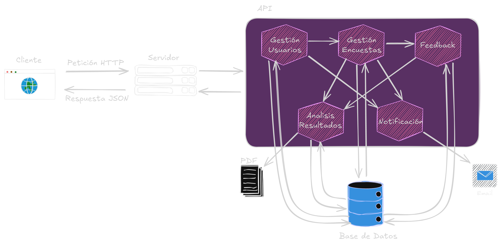

# Python-Django-PostgreSQL-Encuestas

Desarrollo de una API REST que permite a los usuarios crear y participar en encuestas. Ofrece gestión de perfiles, visualización de resultados y notificaciones sobre la actividad de las encuestas, facilitando la recopilación de datos para la toma de decisiones.



## Tecnologías Utilizadas


## Tabla de Contenidos

- [Instalación](#instalación)


## Instalación

### Pasos de Instalación

1. **Clona este repositorio:**

```bash
git clone https://github.com/JohannGaviria/shiny-umbrella.git
```

2. **Crea el entorno virtual:**

Utiliza `virtualenv` o cualquier otro gestor de entornos virtuales. Si `virtualenv` no está instalado, puedes instalarlo con:

```bash
pip install virtualenv
```

Luego, crea y activa el entorno virtual:

```bash
python -m virtualenv venv
# En Windows
venv\Scripts\activate
# En Mac/Linux
source venv/bin/activate
```

3. **Crea las variables de entorno:**
- Crea un archivo `.env` en la ruta raiz del proyecto y configura las siguientes variables:
    - `EMAIL` -> Correo electronico para el envio de notificaciones por email.
    - `PASSWORD` -> La contraseña del correo electronico.

3. **Instalar las dependencias:**

```bash
cd shiny-umbrella
pip install -r requirements.txt
```

4. **Crea las migraciones:**

```bash
python manage.py makemigrations --settings=config.settings.development
python manage.py migrate --settings=config.settings.development
```

5. **Ejecutar el servidor:**

```bash
python manage.py runserver --settings=config.settings.development
```

¡Listo! El proyecto ahora debería estar en funcionamiento en tu entorno local. Puedes acceder a él desde tu navegador web visitando `http://127.0.0.1:8000/`.
